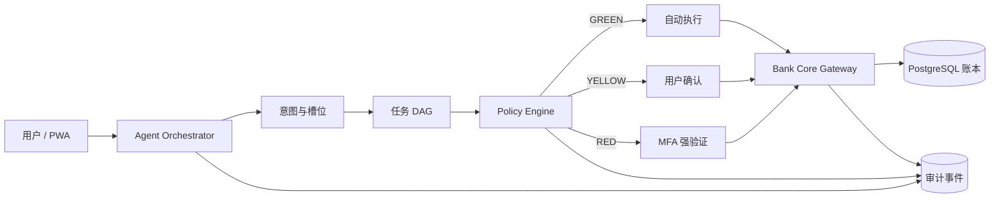

# BankPilot — AI Banking Agent

BankPilot 是一个面向银行 AI 智能体赛题的可运行 PWA。用户用自然语言提出需求，系统完成意图识别、任务 DAG 规划、权限裁决、显式授权、银行核心执行和全链路审计。它不是套壳聊天机器人，也不依赖真实银行私有 API：项目内置一套以 PostgreSQL 为核心的模拟银行，后续可通过适配器替换为银行 OpenAPI、MCP 或核心系统网关。

视觉采用克制的黑白金融界面、单一冷色点缀和大数字排版，参考 Revolut 的极简感但不复制品牌。核心视觉组件“可验证操作凭证”会明确展示金额、收款人、付款账户、风险级别、授权方式、操作编号和最终账本编号。

## 已实现能力

| 场景 | 自然语言示例 | 风险 | 当前实现 |
|---|---|---:|---|
| 余额查询 | `查看余额` | 绿色 | 自动读取账户并回复 |
| 账单分析 | `分析本月账单` | 绿色 | 分类聚合、异常交易提示 |
| 智能转账 | `给张伟转 200 元` | 黄色 | 操作凭证、明确确认、双分录入账 |
| 大额转账 | `给王芳转 1200 元` | 红色 | 绑定交易字段的短信 OTP，错误熔断 |
| 订阅识别 | `查看订阅扣费` | 绿色 | 识别周期扣费、折算月成本 |
| 卡片管理 | `锁定我的日常卡` | 黄色 | 明确确认后更新核心卡状态 |
| 安全审计 | `/audit` | — | 任务 DAG、策略证据、工具节点、事件流 |

演示数据支持收款人“张伟”和“王芳”；红色操作的演示验证码为 `123456`。

## 系统结构



关键原则：LLM/意图层只负责“理解和建议”，没有直接写数据库的权限；写操作必须经过服务端策略引擎和确定性银行工具。转账采用 Prepare → Authorize → Commit 两阶段执行，授权指纹绑定操作编号、账户、收款人、金额和币种。

自然语言层调用真实 OpenAI-compatible 模型两次：第一次产生经过 Zod Schema 校验的意图、实体和 DAG，第二次仅基于银行工具返回的事实生成回复。项目没有规则式意图识别或模板回复回退；未配置模型或模型调用失败时，请求会明确失败，并保证不执行银行操作。

## 本地启动

需要 Node.js 20+、Docker 与 Docker Compose。

```bash
cp .env.example .env.local
# 在 .env.local 填写 AI_BASE_URL、AI_API_KEY、AI_MODEL
npm install
npm run db:setup
npm run dev
```

打开：

- PWA：<http://localhost:3000>
- 安全审计台：<http://localhost:3000/audit>

若系统提供新版 `docker compose` 而不是 `docker-compose`，将 `package.json` 中的命令替换即可。停止数据库使用 `npm run db:down`。重新执行 `npm run db:seed` 会清空业务演示数据并恢复初始状态。

## 验证

```bash
npm test
npm run lint
npm run build
```

已验证的真实闭环包括：黄色转账、红色 MFA、错误验证码不出账、同一操作幂等返回、卡片锁定、审计追踪，以及每笔账本交易两条分录之和为 0。

模型配置：

```dotenv
AI_BASE_URL=https://your-openai-compatible-gateway.example/v1
AI_API_KEY=your-key
AI_MODEL=your-model-id
AI_TIMEOUT_MS=30000
```

## 数据库不是道具

模拟银行使用 PostgreSQL，金额统一以最小货币单位（分）存储，关键表包括：

- `accounts`：余额、状态、乐观锁版本；
- `transfers`：操作状态机、幂等键、授权指纹；
- `ledger_transactions` / `ledger_entries`：双分录账本；
- `cards` / `subscriptions` / `bank_transactions`：银行业务数据；
- `agent_tasks` / `task_nodes`：任务计划和执行节点；
- `policy_decisions` / `authorization_challenges`：权限与 MFA 证据；
- `audit_events`：用户、Agent、策略引擎和银行核心的统一事件流。

迁移文件位于 `db/migrations/001_init.sql`，演示数据位于 `db/seed.sql`。

## PWA

项目包含 Web App Manifest、独立显示模式、移动端安全区适配和生产环境 Service Worker。部署到 HTTPS 后，可在 iOS Safari 或 Android Chrome 中“添加到主屏幕”，形式上与手机银行 App 一致，同时保留 Web 快速迭代能力。

## 接入真实银行的方式

比赛阶段由内置 Bank Core Gateway 调用模拟核心。进入真实试点时，不改 Agent 和 UI，只替换网关：

```text
core.accounts.read       → 银行账户查询 API
core.transactions.read   → 银行流水 API
core.transfer.post       → 支付/转账核心
cards.lock               → 卡管理系统
subscriptions.read       → 代扣管理平台
```

真实接入仍需银行授权、等保/密评、设备身份、反洗钱、反欺诈、交易签名、灾备和人工客服接管。本项目不声称可直接连接任意真实手机银行，也不会通过自动化点击真实银行页面执行交易。

## 参赛资料

- [系统架构](docs/ARCHITECTURE.md)
- [安全设计与自评](docs/SECURITY.md)
- [5 分钟演示脚本与 10 分钟答辩结构](docs/DEMO_SCRIPT.md)
- [CONTABO-jp 部署与运维](docs/DEPLOYMENT.md)
- 视觉验收图：`output/playwright/`

## 项目结构

```text
src/app/api/        Agent、核心操作、审计 API
src/components/     PWA 主界面与安全审计台
src/lib/            Agent 编排、策略引擎、数据库、审计
db/                 PostgreSQL 迁移与种子数据
docs/               架构、安全、答辩材料
public/             PWA 图标与 Service Worker
```
