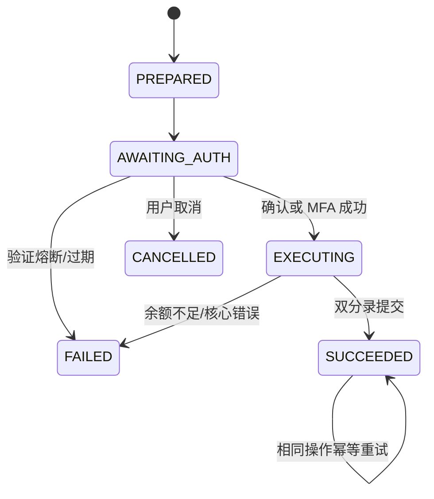

# BankPilot 系统架构

## 1. 产品边界

BankPilot 是“有银行核心约束的 Agent”，不是让大模型直接操作资金。PWA 是用户触点，Agent Orchestrator 负责理解和规划，Policy Engine 是独立的执行闸门，Bank Core Gateway 只暴露白名单工具，PostgreSQL 模拟账户、卡、订阅、流水和账本。

比赛版本调用真实 OpenAI-compatible 大模型完成多轮上下文理解、结构化实体抽取和任务规划。模型输出必须通过 Zod Schema、允许意图与允许步骤枚举、实体解析、权限策略和工具参数白名单，不能直接生成 SQL 或调用任意 URL。系统没有规则式意图识别回退；模型未配置、超时或输出不合规时拒绝执行。

## 2. 分层设计

| 层 | 职责 | 不允许做的事 |
|---|---|---|
| PWA / IM Adapter | 展示、语音/文本输入、收集确认或 MFA | 自行判定权限、缓存完整敏感数据 |
| Agent Orchestrator | 意图、上下文、槽位、DAG、回复 | 直接修改账户余额 |
| Policy Engine | 根据动作、累计金额、收款人、设备、失败次数裁决 | 接受 Prompt 覆盖规则 |
| Authorization | 交易详情确认、OTP/人脸/U 盾适配 | 使用未绑定具体交易的通用授权 |
| Bank Core Gateway | 执行白名单确定性工具、幂等、事务 | 运行模型生成代码 |
| Ledger / Business DB | 业务真相、约束、锁、双分录 | 接受前端直连 |
| Audit Plane | 记录决策、工具、授权和结果 | 被业务 Agent 修改历史记录 |

## 3. 任务 DAG

转账例子：

```text
parse_transfer
  └─ resolve_beneficiary
       └─ check_balance
            └─ policy_check
                 └─ await_authorization
                      └─ post_ledger
```

每个节点记录工具名、依赖、输入摘要、输出摘要、开始/结束时间与状态。生产版本可将执行器替换为 Temporal、Camunda 或银行现有工作流平台，以获得暂停、重试、补偿和人工接管能力。

## 4. 转账状态机



执行事务会锁定转账和相关账户，检查操作状态、认证、账户状态与余额；随后同时写入账本头、借方分录、贷方分录、用户流水和余额，最后更新转账状态。任一步失败全部回滚。

## 5. 数据一致性

- 金额存为 `BIGINT` 分，避免浮点误差；
- `operation_id` 和 `idempotency_key` 唯一；
- 账户行使用 `FOR UPDATE`，按 ID 排序降低死锁概率；
- 账本一借一贷，分录符号由 CHECK 约束保护；
- 余额不得小于 0；
- 操作凭证只在 Bank Core 返回 `SUCCEEDED` 后显示“已入账”；
- 任何超时或异常都回复“未确认”，绝不由 Agent 推测成功。

## 6. 扩展路线

1. 建立对抗注入、模糊表达、上下文指代和事实一致性的模型评测集；
2. 将单体 Bank Core Gateway 替换为银行 API/MCP 适配器；
3. 增加理财适当性、定时转账、AA 收款和跨场景日程 DAG；
4. 引入设备指纹、实时反欺诈评分、动态限额和人工坐席；
5. 将审计事件写入 WORM 存储或日志平台并做告警关联。
